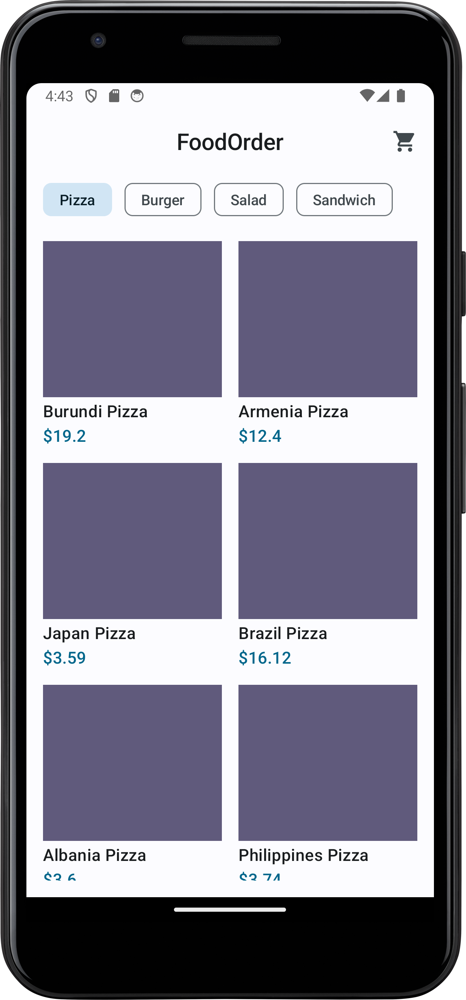
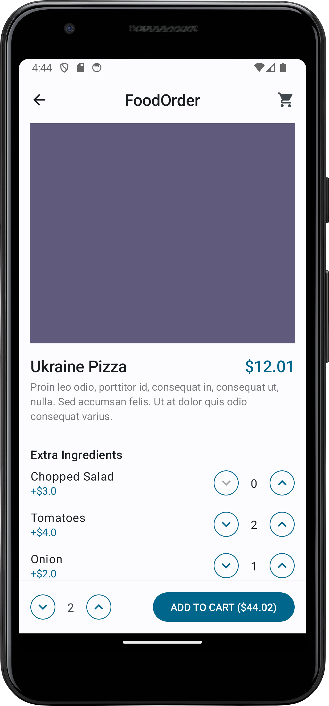
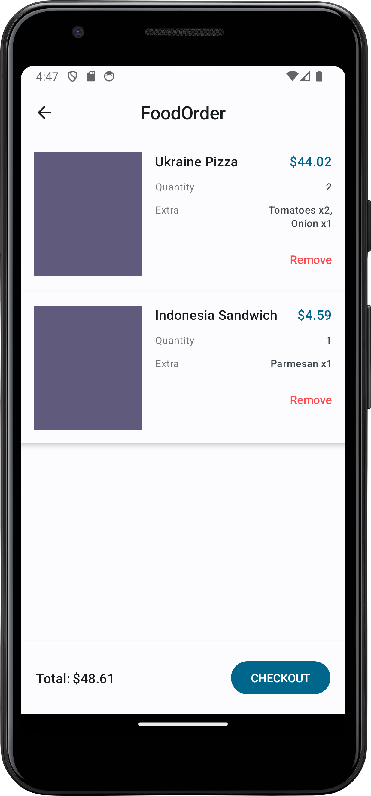

# FoodOrder
Create an app using Jetpack Compose, Ktor and Kotlin Serialization.
The App should contain the following screens:
- **Product Selection**:  
Showing a list of products,
  
- **Product Configuration**:  
Showing selected product with configuration for example single or menu, when selected menu also asking about which drink and side or which extras like extra onion or without)
- **Basket**:  
Here we want to have a overview of all products selected by customer and get the total sum.
Also you need to serialize this

## Demo
  
